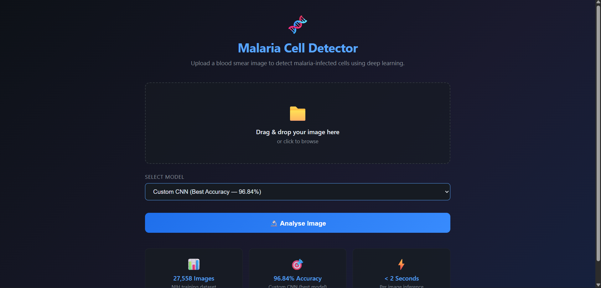
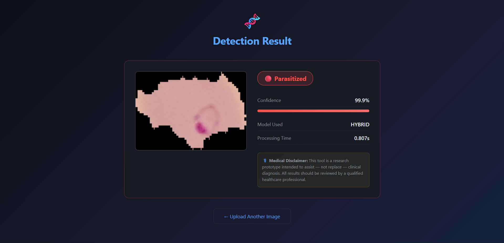
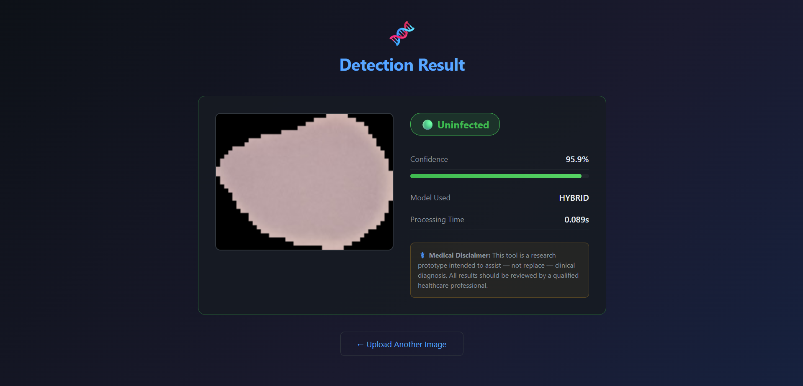
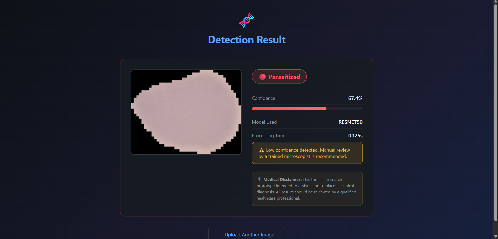

# 🧬 Malaria Cell Detection — Hybrid Deep Learning Models

> **Final Year B.Tech Project · Computer Science & Engineering**  
> Madanapalle Institute of Technology & Science (MITS), 2024–2025

[](https://python.org)
[](https://tensorflow.org)
[](https://flask.palletsprojects.com)
[](LICENSE)
[]()

---

## 📋 Overview

This project develops an automated malaria detection system using deep learning models trained on microscopic blood smear images. The system classifies red blood cell images as either **Parasitized** (malaria-infected) or **Uninfected** with high accuracy, supporting faster and more reliable diagnosis — especially in resource-constrained healthcare settings.

Four architectures are benchmarked:
- A **custom CNN** optimized for this specific task
- **VGG19** with ImageNet transfer learning
- **ResNet50** with ImageNet transfer learning
- A **hybrid CNN-BiLSTM** combining spatial feature extraction with sequential modelling

---

## 🏆 Results Summary

| Model | Accuracy | Precision | Recall | F1-Score | AUC-ROC |
|---|---|---|---|---|---|
| **Custom CNN** | **96.84%** | 0.9785 | 0.9579 | 0.9681 | 0.9923 |
| Hybrid CNN-BiLSTM | 96.41% | 0.9720 | 0.9557 | 0.9638 | 0.9916 |
| VGG19 (Transfer Learning) | 92.71% | 0.9435 | 0.9086 | 0.9257 | 0.9782 |
| ResNet50 (Transfer Learning) | 69.34% | 0.6754 | 0.7446 | 0.7083 | 0.7610 |

> **Dataset:** NIH Malaria Cell Images Dataset — 27,558 images (Parasitized: 13,779 / Uninfected: 13,779)  
> **Best model:** Custom CNN at 96.84% test accuracy  
> **Hardware:** NVIDIA T4 GPU (Google Colab)  
> **Note:** ResNet50's lower score reflects frozen-backbone limitations at 128×128 input resolution. Fine-tuning deeper layers or increasing input size to 224×224 is expected to significantly improve performance.

---

## 📁 Project Structure

```
malaria-detection/
├── notebooks/
│   ├── 01_data_exploration.ipynb       # EDA, class distribution, sample visualization
│   ├── 02_model_cnn.ipynb              # Custom CNN training & evaluation
│   └── 03_model_hybrid.ipynb           # CNN-BiLSTM hybrid model
├── src/
│   ├── preprocessing.py                # Image loading, augmentation, data splits
│   ├── models.py                       # All four model architectures
│   ├── train.py                        # Training pipeline with callbacks
│   ├── evaluate.py                     # Metrics, confusion matrix, plots
│   └── predict.py                      # Single-image inference utility
├── app/
│   ├── app.py                          # Flask web application
│   ├── templates/
│   │   ├── index.html                  # Upload interface
│   │   └── result.html                 # Prediction result display
│   └── static/
│       └── style.css                   # App styling
├── results/
│   ├── training_curves/                # Loss & accuracy plots (PNG)
│   ├── confusion_matrices/             # Per-model confusion matrices
│   ├── training_logs/                  # Per-epoch CSV logs
│   └── metrics_summary.csv            # All experiment results
├── tests/
│   └── test_preprocessing.py          # Unit tests
├── requirements.txt
├── .gitignore
└── README.md
```

---

## 🚀 Quick Start

### 1. Clone & Install

```bash
git clone https://github.com/nitish-reddy25/malaria-detection.git
cd malaria-detection
pip install -r requirements.txt
```

### 2. Download Dataset

Download the [NIH Malaria Cell Images Dataset](https://www.kaggle.com/datasets/iarunava/cell-images-for-detecting-malaria) from Kaggle and extract to:

```
data/
├── Parasitized/
└── Uninfected/
```

### 3. Train a Model

```bash
# Train the custom CNN
python src/train.py --model cnn --epochs 50 --batch_size 32

# Train VGG19 with transfer learning
python src/train.py --model vgg19 --epochs 30 --batch_size 32

# Train the hybrid CNN-BiLSTM
python src/train.py --model hybrid --epochs 50 --batch_size 32
```

### 4. Run the Web App

```bash
cd app
python app.py
# Open http://localhost:5000
```

The app uses a confidence threshold of 0.80. When the model is at least 80% confident in its prediction, it returns "Parasitized" or "Uninfected". When confidence falls below 80%, the result is flagged as "⚠️ Low confidence detected — Manual review recommended" rather than auto-classified — reflecting the cost asymmetry of missing a parasitized cell in a clinical screening context.

---

## 📦 Model Checkpoints

Trained model weights are not included in this repository because they total ~222 MB across the four models, which is larger than recommended for standard Git storage. They can be obtained two ways:

### Option 1 — Download pre-trained checkpoints (recommended)

The four trained `.h5` files are available on Google Drive:

📥 **[Download all four model checkpoints](https://drive.google.com/drive/folders/1Smz6ramDiLmvD3XHwln1UFYFNLF7rsFV?usp=sharing)**

| File | Size | Test Accuracy |
|------|------|---------------|
| `cnn_best.h5` | 15.1 MB | 96.84% |
| `hybrid_best.h5` | 32.2 MB | 96.41% |
| `vgg19_best.h5` | 78 MB | 92.71% |
| `resnet50_best.h5` | 96.4 MB | 69.34% |

After downloading, place all four files in `results/saved_models/` at the repository root. The Flask app (`app/app.py`) will load them from this location automatically.

### Option 2 — Reproduce from scratch

The Custom CNN and Hybrid CNN-BiLSTM models can be retrained from the included Colab notebooks (a free T4 GPU is sufficient for all four models):

- `notebooks/02_model_cnn.ipynb` — Custom CNN
- `notebooks/03_model_hybrid.ipynb` — Hybrid CNN-BiLSTM

The VGG19 and ResNet50 transfer-learning baselines were trained using the procedures documented in the **Model Architectures** section below.

Verified test-set metrics for all four models are committed in [`results/metrics_summary.csv`](results/metrics_summary.csv) and the confusion matrices are in [`results/confusion_matrices/`](results/confusion_matrices/), so the reported numbers can be checked without re-running training.

---

## 🖥️ Web App Preview

The Flask app provides a browser-based interface for real-time inference using any of the four trained models. Below are screenshots from a working local deployment using the trained model checkpoints.

### Upload Interface



Users upload a blood smear image, select a model from the dropdown (Custom CNN is selected by default — the best-performing model at 96.84% accuracy), and click **Analyse Image**.

### Multiple Models, Consistent Predictions

The app supports inference across all four trained models. On a parasitized test image, both top-performing models agree:

**Hybrid CNN-BiLSTM — 99.9% confidence:**



**Custom CNN — 99.8% confidence:**


### Correctly Distinguishing the Negative Class



The Hybrid model correctly classifies an uninfected cell with 95.9% confidence. The visual treatment (green badge, green progress bar) makes the negative result immediately distinguishable from a parasitized one.

### Manual Review Flag in Action



When the model's confidence falls below 0.80, the prediction is flagged for manual review rather than being reported as a confident diagnosis. In this example, the weaker ResNet50 baseline misclassifies an uninfected cell at only 67.4% confidence — well below the threshold — so the warning is displayed and a microscopist is recommended to review the result. This demonstrates the cost-asymmetry-aware safety mechanism that is central to the synopsis's clinical-screening framing.

---

## 🧠 Model Architectures

> **Note on VGG19 and ResNet50.** The two transfer-learning baselines are implemented in `src/models.py` and trained from the command line via `python src/train.py --model vgg19` and `python src/train.py --model resnet50`. Their training logs, metrics, and confusion matrices are saved in `results/`. They don't have dedicated notebooks because all four models share the same training pipeline in `src/train.py`.
>

### Custom CNN
Six convolutional blocks with BatchNormalization and Dropout, designed from scratch for this binary classification task. Best-performing model at **96.84% accuracy**.

### Transfer Learning (VGG19 / ResNet50)
ImageNet-pretrained backbones with frozen convolutional bases and custom classification heads (GlobalAveragePooling → Dense 256 → Dropout → Dense 1). VGG19 achieves 92.71%; ResNet50 underperforms at this input resolution with a frozen backbone.

### Hybrid CNN-BiLSTM
Spatial feature maps from CNN layers are reshaped into sequences and passed through Bidirectional LSTM layers, allowing the model to capture both local texture patterns and spatial dependencies across cell regions. Achieves **96.41% accuracy**.

---

## 📊 Confusion Matrix — Best Model (Custom CNN)

```
                Predicted
                Uninfected   Parasitized
True Uninfected    1349           29
     Parasitized     58         1320
```

False Negatives (58 out of 1,378 parasitized samples, a false-negative rate of 4.21%) are the critical error type in medical diagnosis. The model's high recall (95.79%) minimises this risk.

---

## ⚙️ Requirements

See `requirements.txt`. Key dependencies:
- TensorFlow 2.10+
- OpenCV-Python
- Flask 2.x
- scikit-learn
- NumPy, Pandas, Matplotlib, Seaborn

---

## 👥 Team

| Name | Roll Number |
|---|---|
| Y. Nitish Kumar Reddy | 21691A05C9 |
| B. Mahendra | 21691A0598 |
| M. Manjunath | 21691A05A5 |

**Guide:** G. Vasundhara Devi, Assistant Professor, Dept. of CSE, MITS  
**Institution:** Madanapalle Institute of Technology & Science (MITS), Andhra Pradesh

---

## 📄 License

This project is licensed under the MIT License — see the [LICENSE](LICENSE) file for details.

---

## 🙏 Acknowledgements

- NIH / Kaggle for the [Malaria Cell Images Dataset](https://www.kaggle.com/datasets/iarunava/cell-images-for-detecting-malaria)
- Dr. M. Sreedevi (HoD, CSE) and the faculty of MITS for their support
